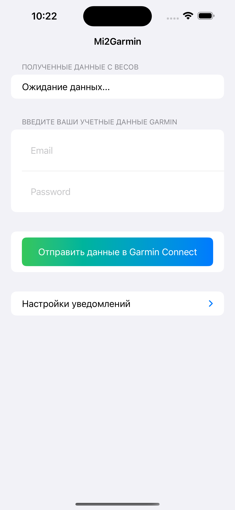
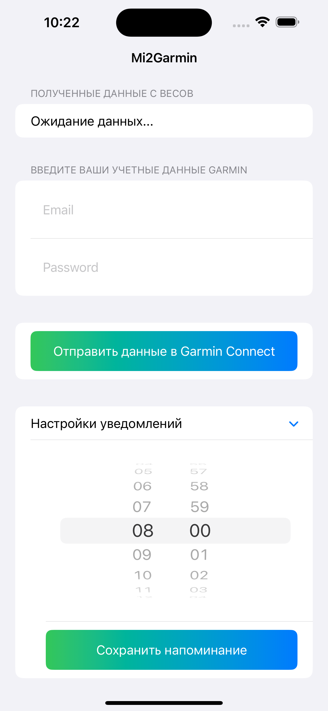

# Mi2Garmin

## Описание
Mi2Garmin — это мобильное приложение для iOS, созданное для людей, ведущих активный образ жизни и использующих весы Mi Scale для отслеживания своего веса. Приложение  отправляет данные с Bluetooth весов в Garmin Connect, обеспечивая удобное и эффективное взаимодействие между вашими устройствами. Также Mi2Garmin предлагает функционал для настройки ежедневных напоминаний о взвешивании, чтобы поддерживать ваши привычки здорового образа жизни.

## Особенности
- Отправка данных о весе в Garmin Connect через Bluetooth.
- Возможность настройки ежеднeвных напоминаний о взвешивании.
- Простой и интуитивно понятный интерфейс.
- Защита личных данных с использованием Keychain.
- Это приложение пересылает ваши данные, email и пароль, напрямую в облако Garmin Connect.  С другой стороны, вы можете использовать прокси API сервер как посредника между приложением и облаком Garmin.
- Прокси API ничего не сохраняет и не регистрирует – это просто промежуточное звено между приложением и сервисами Garmin.
- Репозиторий прокси API: https://github.com/lswiderski/yet-another-garmin-connect-client
- Если вы беспокоитесь о безопасности ваших данных, можете разместить собственный API сервер. Для этого требуется изменить адрес сервера в коде приложения. Пока что можно использовать сервер по умолчанию: https://frog01-20364.wykr.es

## Технологии
- **SwiftUI** для создания пользовательского интерфейса.
- **Core Bluetooth** для работы с Bluetooth устройствами.
- **UNUserNotificationCenter** для настройки локальных уведомлений.
- **Keychain** для безопасного хранения пользовательских данных.

## Начало работы
Для запуска проекта вам понадобится Xcode версии 12 или выше. Склонируйте репозиторий, откройте файл `Mi2Garmin.xcodeproj` в Xcode и запустите симулятор или устройство iOS.

``` bash 
git clone https://github.com/dzarlax/Mi2Garmin.git
cd Mi2Garmin
open Mi2Garmin.xcodeproj
```

## Конфигурация
Перед использованием убедитесь, что ваше устройство подключено к Bluetooth весам и имеет доступ в интернет для отправки данных в Garmin Connect.

## Вклад в проект
Я приветствую любые вклады в развитие проекта. Если вы хотите помочь, пожалуйста, сначала обсудите изменения, которые вы хотели бы внести, через issues в этом репозитории.


## Контакты
Если у вас есть вопросы или предложения, пожалуйста, свяжитесь со мной по адресу me@dzarlax.dev

 
